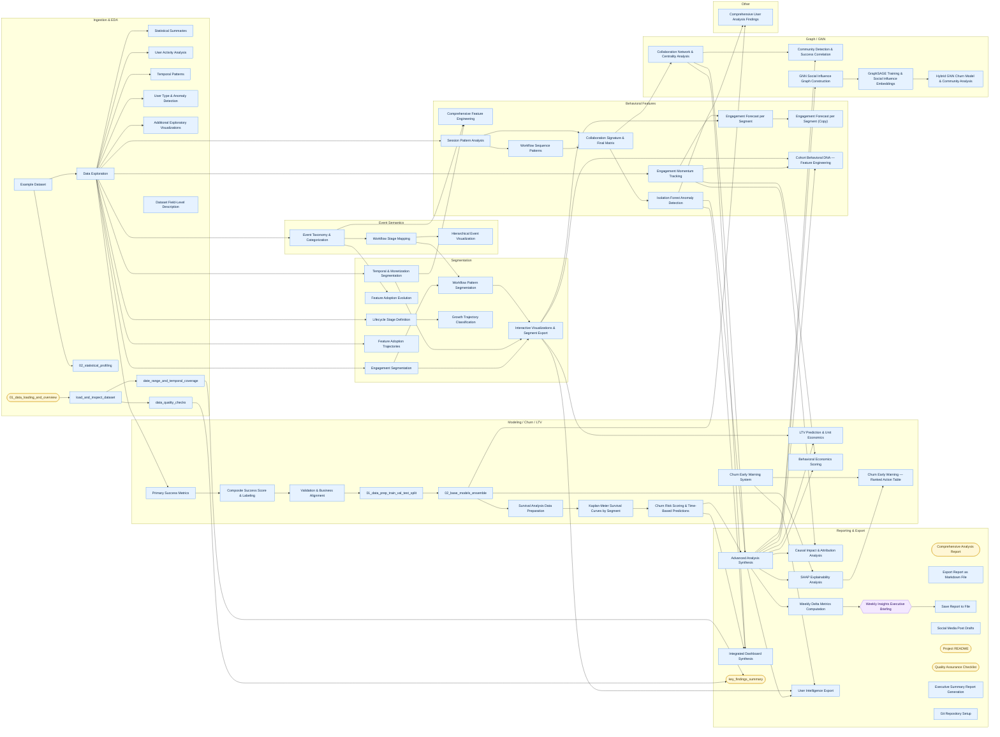

# ZerveXHackerEarth (Clone) - Canvas DAG

- Blocks: **67**
- Edges: **78**
- Source: `canvas.yaml`

## Legend

- Rectangle = code/compute block (`type: 1`)
- Stadium = markdown/note block (`type: 4`)
- Hexagon = LLM/agent block (`type: 9`)
